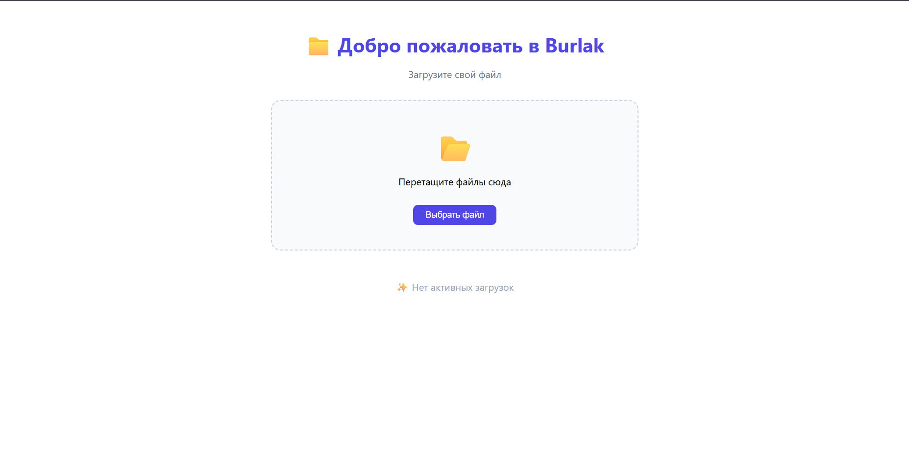

# 📁 Burlak
> Клиентская часть для загрузки больших файлов на сервер с поддержкой чанков и докачки

---

## 🚀 О проекте

**Burlak** — это современное веб-приложение для загрузки больших файлов на сервер. Проект реализован на **Vue 3** с использованием **TypeScript** и **Vite**.

---

## ✨ Основные возможности

- 📤 **Drag & Drop** — перетаскивание файлов мышью
- 📁 **Выбор файлов** через стандартный диалог
- 🔪 **Нарезка на чанки** по 20 МБ через Web Worker
- 📊 **Прогресс загрузки** в реальном времени (по чанкам)
- 🎯 **Статусы** загрузки (загрузка, обработка, готово, ошибка)
- 🗑 **Управление списком** загруженных файлов
- 📥 **Скачивание результатов** (diff.xlsx и cards.zip)
- ⚡ **Web Worker** — нарезка в фоновом потоке (UI не тормозит)
- 🔄 **Retry-логика** — автоматические повторы при ошибках
- 🛡️ **Обработка ошибок** — понятные сообщения для пользователя

---

## 🛠️ Технологии

| Технология | Версия | Назначение |
|------------|--------|------------|
| **Vue 3** | ^3.5 | Фреймворк для UI |
| **TypeScript** | ^5.7 | Типизация |
| **Vite** | ^6.0 | Сборка |
| **Pinia** | ^2.3 | Управление состоянием |
| **Vue Router** | ^4.5 | Маршрутизация |

---

## 📋 Требования

| Требование | Версия |
|------------|--------|
| **Node.js** | ^20.0.0 или выше |
| **npm** | ^10.0.0 или выше |
| **Docker** | ^24.0.0 (опционально) |

---

## 🚀 Установка и запуск

### 1. Убедитесь, что установлен Node.js

```bash
node -v   # должна быть версия 20.x или выше
npm -v    # должна быть версия 10.x или выше
Если Node.js не установлен, скачайте его с официального сайта.

2. Клонировать репозиторий
bash
git clone <url-репозитория>
cd burlak
3. Установить зависимости
bash
npm install
4. Запустить в режиме разработки
bash
npm run dev
Приложение будет доступно: http://localhost:5173

5. Собрать для продакшена
bash
npm run build
Собранные файлы появятся в папке dist/.

6. 🐳 Запуск через Docker
Собрать образ
bash
docker build -t burlak-frontend .
Запустить контейнер
bash
docker run --name burlak-frontend-container -p 5173:5173 burlak-frontend
Приложение будет доступно: http://localhost:5173

Полезные команды Docker
bash
# Остановить контейнер
docker stop burlak-frontend-container

# Запустить остановленный контейнер
docker start burlak-frontend-container

# Посмотреть логи
docker logs burlak-frontend-container

# Удалить контейнер
docker rm burlak-frontend-container

# Удалить образ
docker rmi burlak-frontend

📋 Команды
Команда	Назначение
npm run dev	Запуск в режиме разработки
npm run build	Сборка для продакшена
npm run preview	Предпросмотр собранного проекта
npm run lint	Проверка кода на ошибки
npm run format	Автоформатирование кода
🔗 Интеграция с бэкендом
Для работы с реальным бэкендом необходимо:

Запустить бэкенд на http://localhost:8000 (или другом адресе)

Настроить прокси в vite.config.ts:

typescript
proxy: {
  '/api': {
    target: 'http://localhost:8000',
    changeOrigin: true,
  },
}
Перезапустить проект:

bash
npm run dev
📁 Структура проекта
text
Burlak_front/
├── src/
│   ├── components/
│   │   └── FileUploader.vue      # Главный компонент загрузки
│   ├── composables/
│   │   └── useChunkedUpload.ts   # Логика загрузки с чанками
│   ├── lib/
│   │   └── api.ts                # API-клиент для бэкенда
│   ├── stores/
│   │   └── uploadStore.ts        # Управление состоянием
│   ├── workers/
│   │   └── chunker.worker.ts     # Web Worker для нарезки
│   ├── styles/
│   │   └── main.css              # Глобальные стили
│   ├── App.vue                   # Корневой компонент
│   ├── main.ts                   # Точка входа
│   └── vite-env.d.ts            # Типы для Vite
├── public/
│   └── favicon.svg               # Иконка приложения
├── dist/                          # Собранный проект
├── Dockerfile                     # Docker-конфигурация
├── .dockerignore                  # Исключения для Docker
├── index.html
├── package.json
├── vite.config.ts
└── README.md


📡 API Эндпоинты
Метод	Эндпоинт	Описание
POST	/api/v1/jobs	Создание задачи
PUT	/api/v1/jobs/{id}/files/{role}/chunks/{n}	Загрузка чанка
POST	/api/v1/jobs/{id}/files/{role}/complete	Завершение загрузки файла
POST	/api/v1/jobs/{id}/start	Запуск обработки
GET	/api/v1/jobs/{id}	Получение статуса задачи
GET	/api/v1/jobs/{id}/results/diff	Скачивание diff.xlsx
GET	/api/v1/jobs/{id}/results/cards	Скачивание translated_cards.zip
Параметры
Параметр	Описание
role	bom — BOM-файл (XLSX)
archive — архив с картами (ZIP)
n	Индекс чанка (0-based)
X-Total-Chunks	Общее количество чанков для файла